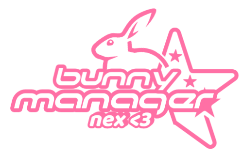

<div align="center">



# 🐰 Bunny Manager

### A cozy little control center for FiveM audio and GTA V graphics


**Install soundpacks, tune common graphics settings, and switch between saved
presets—all from one neon bunny-themed desktop app.**

</div>

---

## 🌸 What is Bunny Manager?

Bunny Manager is a Windows desktop utility designed to make managing a
FiveM/GTA V setup quicker and friendlier. Instead of repeatedly browsing deep
into the GTA V folder or manually editing XML, the app gives you one visual
home for two everyday jobs:

- 🎵 browsing and installing organized soundpacks into GTA V's SFX directory;
- 🎮 editing seven common GTA V graphics settings with simple stepped sliders.

It also includes reusable graphics presets, automatic XML backups, configurable
folder locations, animated notifications, and five neon accent themes.

> [!IMPORTANT]
> Bunny Manager copies soundpack files directly into the selected GTA V
> installation. Keep a backup of original game files and only install packs
> from sources you trust.

## ✨ Features

### 🎧 Soundpack installer

- Scans a chosen directory and treats each immediate subfolder as a soundpack.
- Displays every detected pack in a clean, scrollable library.
- Installs a selected pack into `GTA V\x64\audio\sfx`.
- Recursively merges folders and replaces same-named destination files.
- Performs the copy in a background thread so the interface stays responsive.
- Reports missing folders, invalid destinations, success, and errors through
  status indicators and animated toast messages.
- Supports double-clicking a soundpack to install it quickly.

### 🎮 GTA V graphics editor

Bunny Manager automatically looks for:

```text
Documents\Rockstar Games\GTA V\settings.xml
```

It exposes these settings as Low/Medium/High—or Ultra where supported:

| Setting | Available levels |
| --- | --- |
| Texture Quality | Low → High |
| Particle Quality | Low → High |
| Water Quality | Low → High |
| Shadow Quality | Low → Ultra |
| Reflection Quality | Low → Ultra |
| Grass Quality | Low → Ultra |
| Post FX | Low → Ultra |

The editor handles supported values stored either as an XML `value` attribute
or as element text. Before writing changes, it copies the current file to:

```text
settings.xml.backup
```

> [!NOTE]
> Applying a preset updates the controls first. Select **Save Settings** to
> actually write those values to `settings.xml`.

### 💾 Reusable presets

- Capture the current seven slider values under a custom name.
- Apply presets without immediately changing the XML file.
- Delete presets you no longer need.
- Store presets locally in:

```text
%LOCALAPPDATA%\BunnyManager\gta_settings_presets.json
```

### 🎨 Neon themes

Choose from **Pink**, **Red**, **Blue**, **Green**, or **Orange**. Your choice
is remembered in:

```text
%LOCALAPPDATA%\BunnyManager\appearance.json
```

The interface includes a dark glass-inspired shell, a theme-colored neon
horizon, the bundled Orbitron font, and animated feedback cards. ✨

## 🗺️ App tour

| Page | What it does |
| --- | --- |
| **Installer** | Lists soundpacks and installs the selected pack. |
| **GTA Settings** | Loads, edits, backs up, and saves `settings.xml`; manages presets. |
| **Settings** | Selects the soundpack library and GTA V installation folders. |
| **Info** | Provides an in-app guide and creator details. |

## 🚀 Getting started

### Option 1: Download from GitHub Releases

For the easiest installation, download the latest prebuilt version from the
**[Bunny Manager Releases page](https://github.com/NexOffline/bunnymanager/releases)**.

1. Open the [latest releases](https://github.com/NexOffline/bunnymanager/releases).
2. Choose the newest release.
3. Expand **Assets** if GitHub has not already displayed the downloads.
4. Download the Bunny Manager Windows build uploaded with that release.
5. Extract the archive if it is compressed, then run `BunnyManager.exe`.
6. If Windows displays a security prompt for an unsigned application, inspect
   the downloaded file and choose whether you trust it before continuing.

No separate Python installation is needed for the bundled executable.

> [!TIP]
> Download builds only from the official repository above. The source tree is
> intended for development; release assets are the recommended option for
> regular users.

### Option 2: Run from source

You will need:

- Windows;
- Python 3;
- `customtkinter`;
- Pillow.

```powershell
git clone <your-repository-url>
cd bunnymanager

python -m venv .venv
.\.venv\Scripts\Activate.ps1
python -m pip install --upgrade pip
python -m pip install customtkinter Pillow
python .\soundpack_copier.py
```

The standard-library modules used by the app require no separate installation.

## 🥕 Preparing your soundpacks

Choose one main library folder and place each soundpack in its own subfolder:

```text
Soundpacks\
├── Clean & Crisp\
│   ├── RESIDENT.rpf
│   └── WEAPONS_PLAYER.rpf
├── Heavy Bass\
│   └── ...
└── Retro Pack\
    └── ...
```

Then open **Settings → Soundpacks Folder**, select `Soundpacks`, and refresh
the library. Bunny Manager uses each immediate child directory—such as
`Clean & Crisp`—as one selectable pack.

The files inside a selected pack are copied into:

```text
<GTA V folder>\x64\audio\sfx
```

The pack should therefore contain the same file/folder layout that belongs
inside GTA V's `sfx` directory.

## 🐇 Typical workflow

### Installing a soundpack

1. Close GTA V and FiveM before changing game files.
2. Open **Settings**.
3. Select the folder containing all your soundpack subfolders.
4. Select your GTA V installation folder. Bunny Manager verifies that it
   contains `x64\audio\sfx`.
5. Return to **Installer** and choose a pack.
6. Select **Install soundpack** and wait for the success notification.

### Saving a graphics preset

1. Open **GTA Settings**.
2. Let Bunny Manager load the Documents-based `settings.xml`.
3. Adjust the graphics sliders.
4. Enter a preset name and select **Save Preset**.
5. Select **Save Settings** when you want to commit the displayed values.

## 🔍 Automatic path detection

Bunny Manager checks common Steam and Rockstar installation locations for GTA
V, including:

```text
E:\SteamLibrary\steamapps\common\Grand Theft Auto V
C:\Program Files (x86)\Steam\steamapps\common\Grand Theft Auto V
C:\Program Files\Rockstar Games\Grand Theft Auto V
```

If none exists, simply choose the correct folder on the **Settings** page.
For `settings.xml`, the app checks both OneDrive Documents and the regular user
Documents folder.

## 🛠️ Building the executable

The included PyInstaller specification bundles the fonts, logo, and application
icon:

```powershell
python -m pip install pyinstaller customtkinter Pillow
pyinstaller .\BunnyManager.spec --clean
```

The generated executable will be written to `dist\BunnyManager.exe`. Upload
that executable—or an archive containing it—to a new GitHub Release.

## 📁 Project structure

```text
bunnymanager/
├── assets/
│   ├── fonts/                  # Orbitron font files and license
│   └── images/                 # Bunny logo and Windows icon
├── soundpack_copier.py         # Main UI and application logic
├── BunnyManager.spec           # PyInstaller build configuration
└── README.md
```

Generated `build/`, `dist/`, and `__pycache__/` content is not required when
running directly from source.

## 🩹 Troubleshooting

<details>
<summary><strong>“Soundpacks folder not found”</strong></summary>

Open **Settings**, select an existing library folder, and choose **Refresh
library**. Remember that soundpacks must be subfolders—not loose files directly
inside the main library folder.

</details>

<details>
<summary><strong>“Destination not found” or “GTA folder not recognized”</strong></summary>

Select the GTA V root folder, not `x64`, `audio`, or `sfx`. A valid selection
must contain:

```text
x64\audio\sfx
```

</details>

<details>
<summary><strong>“Settings file not found”</strong></summary>

Launch GTA V at least once so it can create `settings.xml`. Bunny Manager
currently resolves this file automatically from the OneDrive or regular
Documents location; there is no manual file picker for it.

</details>

<details>
<summary><strong>A preset did not change the game</strong></summary>

Applying a preset only stages its values in Bunny Manager. Select **Save
Settings** afterward, then restart the game if it was running.

</details>

<details>
<summary><strong>I need to undo graphics changes</strong></summary>

Close the game, preserve the current XML if needed, and restore
`settings.xml.backup` as `settings.xml`. Each new save replaces the previous
backup, so it represents only the state immediately before the most recent
save.

</details>

## 🔐 Safety notes

- Close GTA V and FiveM before installing packs or editing settings.
- Back up original SFX files yourself; the installer does **not** create an SFX
  backup or offer automatic uninstall/rollback.
- Installing a pack may overwrite same-named files in the destination.
- The XML editor creates a single `.backup` file before each save.
- Use soundpacks compatible with your current GTA V/FiveM installation.
- The app is intended for local file management and does not download packs.

## 🤝 Contributing

Contributions and thoughtful improvements are welcome. A simple workflow is:

1. Fork the repository.
2. Create a focused feature branch.
3. Make and test your changes on Windows.
4. Open a pull request describing what changed and how you verified it.

Useful additions could include tests, a dependency file, configurable XML
paths, soundpack backups, or improved install/restore workflows.

## 📜 License

No project-level license file is currently included. Unless the repository
owner adds one, the source should be treated as **all rights reserved** by
default. The bundled Orbitron font has its own license in
`assets/fonts/OFL.txt`.

## 💗 Credits

Created by **Nex**  
Discord: `nexoffline`

<div align="center">

### 🐰 Manage less. Play more. Hop on. ✨

</div>
